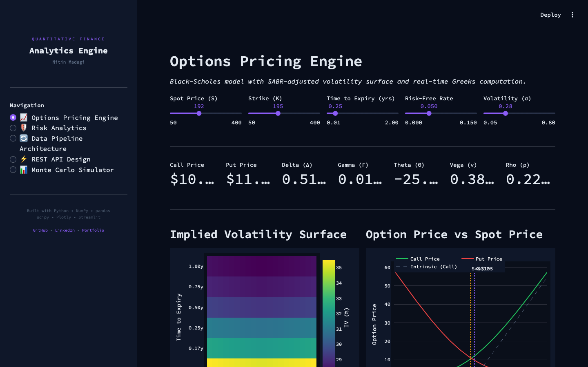

# Quantitative Analytics Engine

A quantitative finance analytics platform built with Python, featuring options pricing, a market implied volatility surface, machine learning pricers benchmarked against Black-Scholes, portfolio risk management, data pipeline architecture, and REST API design for capital markets applications.




## Live Demo

**[▶ Launch App](https://quant-analytics-engine.streamlit.app)** *(update this URL after deployment)*

---

## Features

### Options Pricing Engine
- Black-Scholes pricing with real-time Greeks (Delta, Gamma, Theta, Vega, Rho)
- Implied volatility solver (Brent root finding with no-arbitrage bounds)
- Market implied volatility surface from live yfinance option chains: OTM quotes only, dead and crossed quotes dropped, one smile per expiry
- Modeled smile fallback when market data is unavailable
- Option price vs spot and Greeks sensitivity charts

### ML Pricer Benchmark
- Random Forest and neural network (MLP) pricers versus flat-vol Black-Scholes
- Each learned pricer starts from the Black-Scholes price and learns the smile correction
- Synthetic quote history with a time-based train/test split, or a live option chain snapshot
- MSE, RMSE and MAE per pricer plus MAE by moneyness bucket, predicted vs market and error vs moneyness charts

### Risk Analytics
- Value-at-Risk (VaR) - Historical, Parametric, and Monte Carlo methods
- Conditional VaR / Expected Shortfall
- Stress testing across 8 macroeconomic scenarios
- Portfolio Greeks exposure monitoring
- Position-level risk attribution

### Data Pipeline Architecture
- ETL design for 50M+ row financial datasets
- PostgreSQL schema with date partitioning and composite indexes
- Trade blotter, market data, and risk snapshot tables
- Data quality validation framework with smart backfill
- Query optimization patterns (window functions, LATERAL joins)

### REST API Design
- FastAPI microservice architecture for pricing and order management
- Pre-trade risk check pipeline (VaR impact, position limits, concentration, Greeks)
- Pydantic request/response validation
- Idempotency keys for order deduplication
- Full endpoint documentation with request/response examples

### Monte Carlo Simulator
- Geometric Brownian Motion price path simulation (up to 10,000 paths)
- Percentile band visualization (5th, 25th, 50th, 75th, 95th)
- Terminal price distribution analysis
- Monte Carlo vs Black-Scholes convergence comparison
- Standard error and convergence analysis

---

## Tech Stack

| Layer | Technologies |
|-------|-------------|
| **Computation** | Python, NumPy, pandas, scipy, scikit-learn |
| **Market Data** | yfinance option chains |
| **Visualization** | Plotly, Streamlit |
| **Database Design** | PostgreSQL (schema, partitioning, indexing) |
| **API Framework** | FastAPI, Pydantic, uvicorn |
| **Models** | Black-Scholes, implied vol, Random Forest, MLP, Monte Carlo, VaR/CVaR |

---

## Getting Started

```bash
# Clone
git clone https://github.com/nmadagi/quant-analytics-engine.git
cd quant-analytics-engine

# Install dependencies
pip install -r requirements.txt

# Run locally
streamlit run app.py

# Run tests
pip install pytest
pytest tests/ -v
```

---

## Project Structure

```
quant-analytics-engine/
├── app.py                  # Streamlit application (all pages)
├── quant_core.py           # Black-Scholes, Greeks, implied vol, modeled smile, Monte Carlo VaR
├── market_vol.py           # yfinance option chain fetch and market implied vol surface
├── ml_pricer.py            # Synthetic quotes, Random Forest and MLP pricers, benchmark vs Black-Scholes
├── tests/                  # pytest suite (offline, synthetic chains and quotes)
├── requirements.txt        # Python dependencies
├── .streamlit/
│   └── config.toml        # Streamlit theme configuration
└── README.md              # This file
```

---

## Key Technical Highlights

- **Market implied vol, not a modeled smile**: the surface is solved quote by quote from live bid-ask mids
- **Honest ML benchmark**: learned pricers are scored out of sample on later quote days, against the same inputs Black-Scholes gets
- **Vectorized computation**: pricing and risk calculations use NumPy vectorization for performance
- **Production-grade schema**: PostgreSQL design handles 50M+ rows with partitioning and composite indexes
- **Pre-trade risk gates**: Order submission includes VaR impact, position limits, concentration, and Greeks exposure checks
- **Monte Carlo convergence**: Demonstrates MC pricing converging to analytical Black-Scholes as path count increases
- **Testable core**: pricing, surface and benchmark logic live in UI-free modules covered by pytest in CI

---

## Author

**Nitin Madagi** - Quantitative Risk & Financial Engineering

- [GitHub](https://github.com/nmadagi)
- [LinkedIn](https://www.linkedin.com/in/nmadagi)
- [Portfolio](https://nmadagi.github.io/portfolio/)

---

## License

This project is licensed under the [MIT License](LICENSE).
